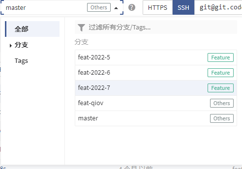

# git-前端团队协作开发规范

## 一：代码提交 commit 规范

Git Commit 最大的价值就是标注信息，那如何才能够最高效地标识清楚修改的内容就是 Git Commit 的最大意义。

```
type: commit 的类型
feat: 新特性
fix: 修改问题
refactor: 代码重构
docs: 文档修改
style: 代码格式修改, 注意不是 css 修改
test: 测试用例修改
chore: 其他修改, 比如构建流程, 依赖管理.
pref: 性能提升的修改
build: 对项目构建或者依赖的改动
ci: CI 的修改
revert: revert 前一个 commit
```

### 多文件例子

```
demo: git commit -m "feat: 完成登录注册页面构建"
demo: git commit -m "fix: 修复登录失败bug"
```

### 单文件例子

```
demo: git commit -m "fix(login): 修复登录失败bug"
type类型后面加入单文件的组件名或者文件名
```


## 二：分支管理

随着项目越来越大，开发团队的人员增加，分支的管理也是要重视起来
最简单的规划就是跟随时间以月度为单位，每个迭代或者每个需求周期一个分支
方便后期迭代更新



### 分支准则

一般 git 分支协作分为 master,dev，以及日常开发分支 feat-xxxx-xx。

- master：为锁定保护主分支，上线生产环境。
- dev：为测试分支，为其它月分支开发完成提测时合并的分支，只有 dev 测试完成后，需求结束，可合并到 master 分支。
- feat-xxxx-xx：为某年某月需求分支，方便管理，再每次需求迭代完成后，合并到 dev 分支提测。
