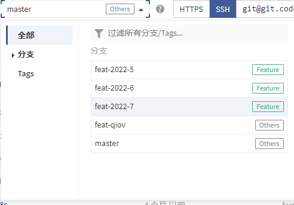
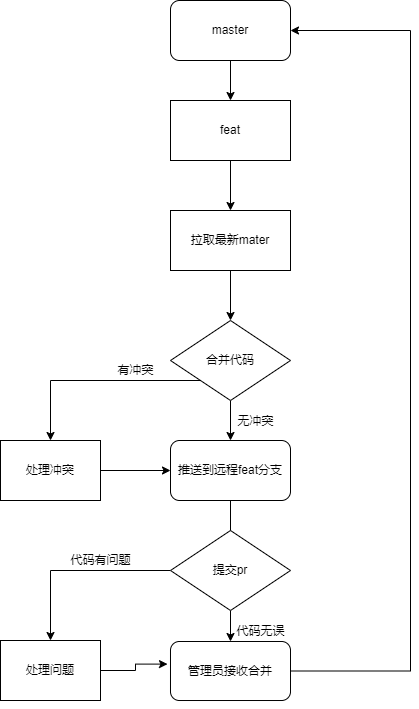
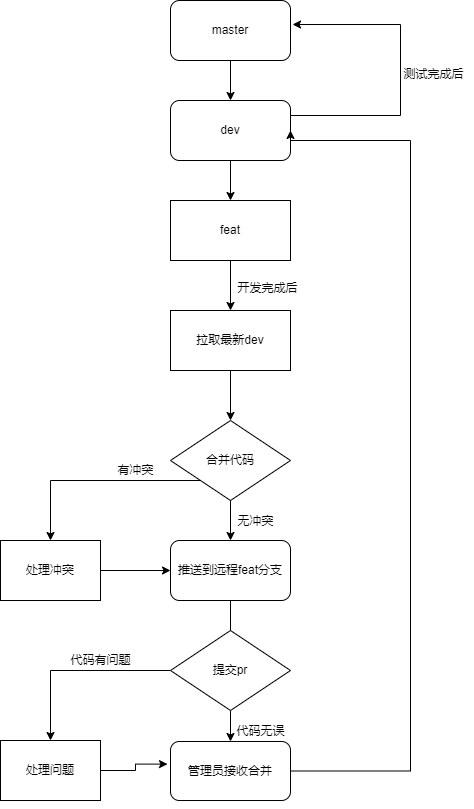

# git-前端团队协作开发规范

## 代码提交 commit 规范

Git Commit 最大的价值就是标注信息，那如何才能够最高效地标识清楚修改的内容就是 Git Commit 的最大意义。

```
type: commit 的类型
feat: 新特性
fix: 修改问题
refactor: 代码重构
docs: 文档修改
style: 代码格式修改, 注意不是 css 修改
test: 测试用例修改
chore: 其他修改, 比如构建流程, 依赖管理.
pref: 性能提升的修改
build: 对项目构建或者依赖的改动
ci: CI 的修改
revert: revert 前一个 commit
```

### 多文件例子

```
demo: git commit -m "feat: 完成登录注册页面构建"
demo: git commit -m "fix: 修复登录失败bug"
```

### 单文件例子

```
demo: git commit -m "fix(login): 修复登录失败bug"
type类型后面加入单文件的组件名或者文件名
```


## 分支管理（适用于单人开发及老项目维护）

随着项目越来越大，开发团队的人员增加，分支的管理也是要重视起来
最简单的规划就是跟随时间以月度为单位，每个迭代或者每个需求周期一个分支
方便后期迭代更新



### 分支准则

一般 git 分支协作分为 master,dev，以及日常开发分支 feat-xxxx-xx。

- master：为锁定保护主分支，上线生产环境。
- dev：为开发分支，为其它月分支开发完成提测时合并的分支，只有 dev 测试完成后，需求结束，可合并到 master 分支。
- feat-xxxx-xx：为某年某月需求分支，方便管理，再每次需求迭代完成后，合并到 dev 分支提测。

## GitFlow 工作流模式(适用于多人协同开发)

为避免多人协同开发时出现以下问题

1. 覆盖他人代码
2. 代码未统一规范
3. 代码冲突
4. 分支目的不明确

### 一：分支与角色说明

git 分支

- master 分支（主分支） 稳定版本
- dev 分支（开发分支） 最新版本
- hotfix 分支（热修复分支） 修复线上 Bug
- feature 分支（特性分支） 实现新特性

项目角色

- Owner（拥有者） Git 管理员
- Master（管理员） 开发主管
- Developer（开发者） 开发人员

### 二、分支简明使用流程

1. 每开发一个新功能，创建一个 feature 分支，多人在此分支上开发；
2. 提测时，将开发好的 feature 分支合并到 dev 分支并发布测试环境；
3. 发现 bug 时，在 feature 分支上 debug 后，再次回到 2；
4. 发布生产环境后，将 dev 分支合并到 master 分支，删除所有开发完成的 feature 分支；

### 三、新建项目开发流程

1. 开发主管新建 master 分支
2. 开发人员各自从 master 上面新建功能分支，如 feat-user,feat-login 等
3. 新功能开发完成后，拉取 master 分支最新代码并合并，然后将合并完成的最新代码推送到远程仓库
4. 提交 pull request，将功能分支合并到 master 分支
5. 开发主管进行代码审查，有问题则提出，开发人员进行修改，没问题之后接受代码合并



### 四、项目迭代开发流程

1. 开发主管新建 dev 分支
2. 开发人员各自从 dev 上面新建功能分支，如 feat-user,feat-login 等
3. 新功能开发完成后，拉取 dev 分支最新代码并合并，然后将合并完成的最新代码推送到远程仓库
4. 提交 pull request，将功能分支合并到 dev 分支
5. 开发主管进行代码审查，有问题则提出，开发人员进行修改，没问题之后接受代码合并
6. 测试完毕后，将 dev 分支合并到 master 分支



### 五、线上 bug 修复流程

1. master 分支上新建 fix-xxx 分支
2. 修复完 bug 后推送至远程仓库
3. 测试测完后提交 pull request 到 master
4. 开发主管接受合并
